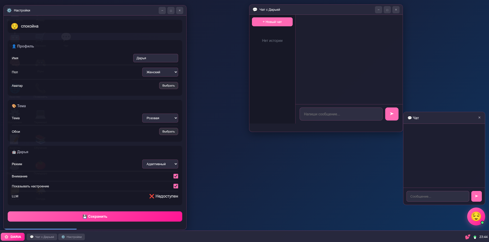

<p align="center">
  
</p>

<h1 align="center">🌸 DARIA</h1>

<p align="center">
  <strong>AI Desktop Companion • Живой локальный ассистент в формате desktop-интерфейса</strong>
</p>

<p align="center">
  
  
  
  
</p>

<p align="center">
  <a href="#-что-это">Что это</a> •
  <a href="#-ключевые-возможности-092">Возможности</a> •
  <a href="#-быстрый-старт">Быстрый старт</a> •
  <a href="#-плагины">Плагины</a> •
  <a href="#-документация-и-релизы">Документация</a>
</p>

---

## 🌸 Что это

**DARIA** (Desktop AI Reactive Intelligent Assistant) — локальный AI-компаньон с веб-интерфейсом в стиле рабочего стола.

Проект сочетает:

- живой диалог с эмоционально-вариативным стилем (`v0.9.2`),
- desktop UX (окна, приложения, уведомления, мониторинг),
- мультимодальность (чат, изображения, музыка, сенсоры),
- систему задач, памяти и автономных действий Даши,
- расширяемость через плагины.

<p align="center">
  
</p>

Дополнительные скриншоты:

- `docs/screenshots/desktop-overview.svg`
- `docs/screenshots/chat-image-and-stickers.svg`
- `docs/screenshots/player-and-calendar.svg`

---

## ✨ Ключевые возможности 0.9.2

### Общение и личность

- новая диалоговая архитектура (`EmotionExpressionLayer`, `ConversationRhythmLayer`, `ReactionVariabilitySystem` и др.),
- меньше шаблонности и повторов, более естественный ритм,
- управляемая частота встречных вопросов (без постоянного «вопрос в конце»),
- мягкие сенсорные и личностные детали в ответах.

### Desktop-интерфейс

- окна приложений с desktop-навигацией,
- переработанное меню «Пуск» с группами,
- монитор Даши (`CPU/RAM/threads/uptime`),
- календарь, задачи, память, обновления, магазин плагинов,
- контекстное меню рабочего стола, автосмена обоев, пакеты иконок.

### Чат и мультимодальность

- чат с историей и фильтрами (`Все / Личные / Telegram`),
- инструменты сообщений: стикеры, вложения, ссылки,
- генерация изображений в фоне с прогрессом (jobs + polling),
- связка `картинка + описание + вопрос` без «фантазирования» деталей,
- улучшенный слух/аудио-анализ (tempo/energy/summary).

### Музыка

- отдельное окно плеера с очередью,
- кэш треков в `~/.daria/music_cache`,
- сохранение очереди в `~/.daria/music_queue.json`,
- восстановление после перезапуска,
- поддержка внешних источников и локальных файлов.

### Дневник

- единый файл-книга: `~/.daria/files/dasha_notes/daria_diary_book.md`,
- дневник ведётся только Дашей,
- для пользователя дневник открыт в режиме чтения.

### Инфраструктура и устойчивость

- debug trace режим: `--debug-trace` + `~/.daria/debug-trace.log`,
- runtime-диагностика (`/api/debug/runtime`),
- улучшенная обработка ошибок в UI/API,
- поддержка HTTPS и сетевого режима.

---

## 🧭 Приложения рабочего стола

Базовые окна DARIA:

- 💬 Разговор с Дашей
- 🪞 Состояние Даши
- ✅ Списки дел
- 👁️ Чувства и восприятие
- 📚 База знаний (Wiki)
- 📅 Календарь
- 📁 Файлы
- 📝 Дневник Даши (read-only для пользователя)
- 📖 Инспектор знаний
- 🎮 Игровой центр
- 🎵 Музыка
- 💻 Консоль
- 📈 Монитор Даши
- 🛒 Магазин
- 🧠 Память
- ⚙️ Настройки
- ⬆️ Обновления

---

## 🚀 Быстрый старт

### 1) Требования

- Python `3.10+`
- `pip`
- (Рекомендуется) [Ollama](https://ollama.ai) для локальной LLM
- (Опционально) `openssl` для HTTPS-сертификата

### 2) Установка

```bash
git clone https://github.com/dariumi/Daria.git
cd Daria
python install.py
```

Установщик:

- создаёт `venv`,
- ставит зависимости,
- подготавливает `~/.daria/*`,
- предлагает профиль установки (`base / recommended / full`),
- может предзагрузить модели.

### 3) Запуск

Linux/macOS:

```bash
./start.sh
```

HTTPS (LAN):

```bash
./start-https.sh
```

С запуском в tray:

```bash
./start-tray.sh
```

Альтернатива прямым запуском:

```bash
python main.py --host 127.0.0.1 --port 7777
```

Открыть в браузере:

- `http://127.0.0.1:7777`

---

## ⚙️ Полезные CLI-флаги

```bash
python main.py --check
python main.py --debug
python main.py --debug-trace
python main.py --ssl --ssl-cert ~/.daria/ssl/cert.pem --ssl-key ~/.daria/ssl/key.pem
python main.py --tray
python main.py --version
```

---

## 🧩 Плагины

Встроенные плагины в репозитории:

- `voice-call` — голосовой звонок
- `telegram-bot` — Telegram интеграция
- `server-mode` — многопользовательский режим
- `training` — обучение стиля
- `games` — отдельные мини-игры
- `weather` — погода
- `pomodoro` — таймер
- `notes` — заметки

Установка/обновление плагинов доступна через окно `🛒 Магазин`.

Документация по плагинам: `docs/PLUGINS.md`

---

## 📚 Документация и релизы

Wiki:

- `docs/wiki/Home.md`
- `docs/wiki/Knowledge-Base.md`
- `docs/wiki/Troubleshooting.md`
- `docs/wiki/Updater-App.md`

Release/update logs:

- `docs/updatelogs/UPDATELOG_v0.9.2.md`
- `docs/updatelogs/UPDATELOG_v0.9.1.md`
- `docs/updatelogs/UPDATELOG_v0.9.0.md`
- `docs/updatelogs/README.md`

---

## 🗂️ Структура проекта

```text
Daria/
├── main.py
├── install.py
├── VERSION
├── requirements.txt
├── core/
├── web/
│   ├── app.py
│   ├── image_pipeline.py
│   ├── templates/
│   └── static/
├── plugins/
├── docs/
└── tests/
```

---

## 🔒 Данные пользователя

Основные данные хранятся в `~/.daria`:

- настройки,
- чаты и память,
- файлы пользователя,
- дневник,
- кэш музыки,
- SSL и служебные логи.

---

## 💖 Поддержка

<p align="center">
  <a href="https://www.buymeacoffee.com/dariumi">
    
  </a>
  <a href="https://boosty.to/dariumi">
    
  </a>
</p>

---

## 📜 Лицензия

MIT License

